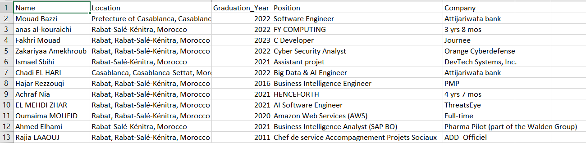

# ENSIAS Alumni Scraper and Data Visualization

This project combines the power of **web scraping** and **data visualization** to uncover insights about ENSIAS alumni. By scraping LinkedIn profiles and enriching the data with a local database provided by the **ENSIAS Bridge Club**, we were able to create meaningful and interactive visualizations that showcase alumni career paths, skills, and achievements.

---

## Table of Contents
- [Getting Started](#getting-started)
- [Prerequisites](#prerequisites)
- [Installation](#installation)
- [Usage](#usage)
- [Data Visualization](#data-visualization)
- [Contributing](#contributing)
- [License](#license)

---

## Getting Started

To run this project, you’ll need **Python** installed on your system. For better practicality and to avoid dependency conflicts, it’s recommended to create a virtual environment.

---

## Prerequisites

Before running the project, ensure you have the following installed:
- Python 3.7 or higher
- Jupyter Notebook
- Git (optional, for cloning the repository)

---

## Installation

### Steps to Get Started:
1. **Clone the Repository**:
   If you haven’t already, clone the repository to your local machine:
   ```bash
   git clone https://github.com/rachdonhabibi/ensias-alumni-scraper.git
   cd ensias-alumni-scraper
   ```
2. **Create a Virtual Environment** (optional, but recommended):
   ```bash
   python -m venv venv
   ```
3. **Activate the Virtual Environment**:
   - On Windows:
     ```bash
     venv\Scripts\activate
     ```
   - On macOS and Linux:
     ```bash
     source venv/bin/activate
     ```

4. **Install the Requirements**:
   ```bash
   pip install -r requirements.txt
   ```

5. **Run the Notebook**:
   You can run the notebook to perform the scraping and initial data processing.

---

## Data Cleaning and Enrichment

After running the notebook, you will obtain a CSV file containing the scraped alumni data.
The image below (`output.png`) is an example of the output of the notebook :


To further enhance the dataset, we cleaned the extracted data and enriched it using the confidential database provided by ENSIAS Bridge Club, which contains comprehensive information about a large number of alumni. This enrichment process added two key attributes to our dataset:

- **Sex** (Gender)
- **Major** (translated from French "filière")

This allowed us to gain deeper insights and more meaningful visualizations.


---

## Data Visualization

With the enriched CSV file (note: no data warehouse or other advanced storage was used; the file used for visualization was simply a CSV file), we created interactive visualizations using Power BI. These visualizations help illustrate trends, distributions, and statistics about ENSIAS alumni, including career paths, gender distribution, and majors.

---

## Contributing

Contributions are welcome! Please open an issue or submit a pull request if you wish to contribute.

---

## License

This project is licensed under the MIT License.
