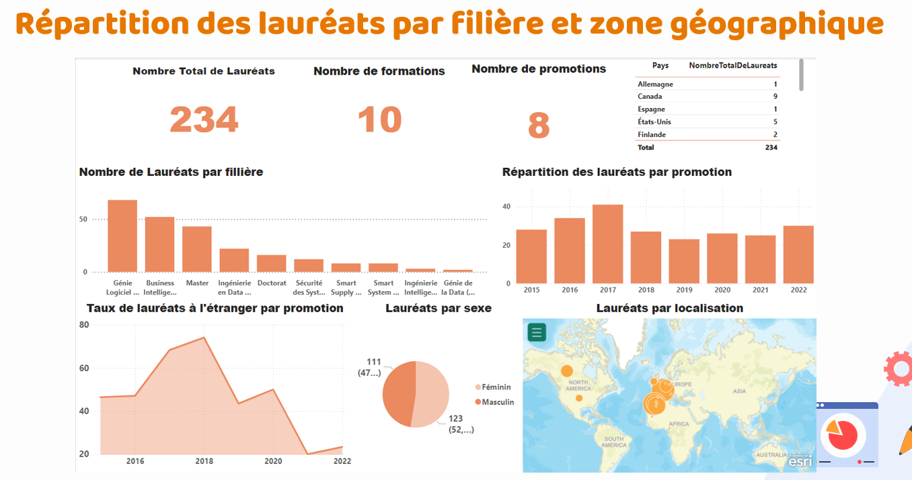
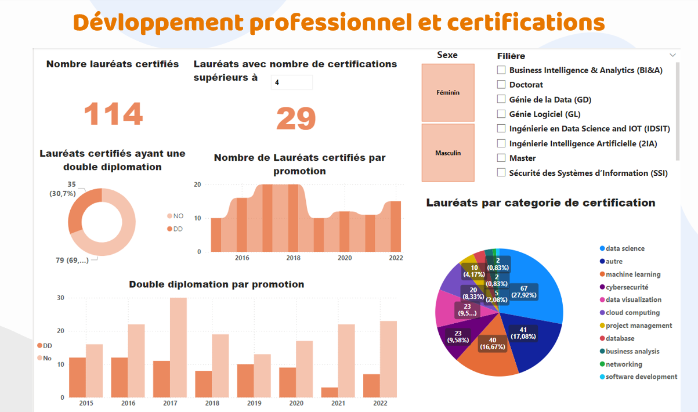
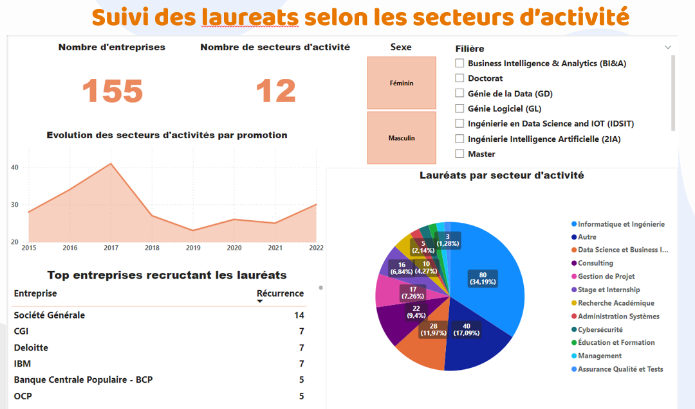

# ENSIAS Alumni Scraper and Data Visualization

This project combines the power of **web scraping** and **data visualization** to uncover insights about ENSIAS alumni. By scraping LinkedIn profiles and enriching the data with a local database provided by the **ENSIAS Bridge Club**, we were able to create meaningful and interactive visualizations that showcase alumni career paths, skills, and achievements.

---

## Table of Contents
- [Getting Started](#getting-started)
- [Prerequisites](#prerequisites)
- [Installation](#installation)
- [Usage](#usage)
- [Data Visualization](#data-visualization)
- [Contributing](#contributing)
- [License](#license)

---

## Getting Started

To run this project, you’ll need **Python** installed on your system. For better practicality and to avoid dependency conflicts, it’s recommended to create a virtual environment.

---

## Prerequisites

Before running the project, ensure you have the following installed:
- Python 3.7 or higher
- Jupyter Notebook
- Git (optional, for cloning the repository)

---

## Installation

### Steps to Get Started:
1. **Clone the Repository**:
   If you haven’t already, clone the repository to your local machine:
   ```bash
   git clone https://github.com/rachdonhabibi/ensias-alumni-scraper.git
   cd ensias-alumni-scraper
   ```
2. **Create a Virtual Environment** (optional, but recommended):
   ```bash
   python -m venv venv
   ```
3. **Activate the Virtual Environment**:
   - On Windows:
     ```bash
     venv\Scripts\activate
     ```
   - On macOS and Linux:
     ```bash
     source venv/bin/activate
     ```

4. **Run the Notebook**:
   You can run the notebook to perform the scraping and initial data processing.

---

## Data Cleaning and Enrichment

After running the notebook, you will obtain a CSV file containing the scraped alumni data.
The image below (`output.png`) is an example of the output of the notebook :


To further enhance the dataset, we cleaned the extracted data and enriched it using the confidential database provided by ENSIAS Bridge Club, which contains comprehensive information about a large number of alumni. This enrichment process added two key attributes to our dataset:

- **Sex** (Gender)
- **Major** (translated from French "filière")

This allowed us to gain deeper insights and more meaningful visualizations.


---

## Data Visualization

With the enriched and cleaned CSV file processed with pandas (note: no data warehouse or other advanced storage was used; the file used for visualization was simply a CSV file), we created interactive visualizations using **Power BI**. These visualizations help illustrate trends, distributions, and statistics about ENSIAS alumni, including career paths, gender distribution, and majors.

### Dashboards

#### 1. Distribution of Alumni by Major and Geographic Area


This dashboard shows the distribution of 234 alumni across majors, graduation years, and countries. The most represented majors are Software Engineering and Business Intelligence, with alumni spread internationally—especially in Europe and North America. Gender distribution is balanced, and the map visualization highlights a strong global presence for ENSIAS graduates.

#### 2. Professional Development and Certifications


Here, we focus on alumni certifications and double degrees. About half of the alumni have at least one certification, mainly in data science, software development, and project management. A significant share also pursued double degrees. The dashboard allows filtering by gender and field of study, showing that professional development opportunities are accessible across the board.

#### 3. Alumni by Sector and Top Employers


This dashboard tracks the industry sectors and employers hiring ENSIAS alumni. IT and engineering dominate, but consulting and data science are also strong. Companies like Société Générale, CGI, and IBM are top recruiters. The number of sectors employing alumni has grown, reflecting the versatility of ENSIAS graduates.

---

### Summary

These dashboards together provide a clear and concise overview of ENSIAS alumni outcomes. They reveal strong representation in technology and engineering fields, broad international mobility, ongoing professional development, and close ties to leading employers. As a data analyst, these insights demonstrate ENSIAS’s effectiveness in preparing students for successful, global careers and in meeting the evolving demands of the job market.

